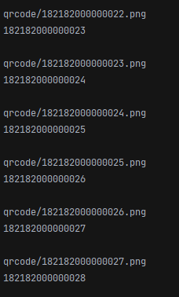

## QRcode generator
**Author:** @ArchieWh1te

**Language:** Python 3.8

**Library pypi:** qrcode 7.3.1

**License:** Free

## Описание:
Скрипт который генерирует большое количество ШК (ШтрихКод) в QRcode из файла txt и сохраняет в PNG формате.

**Для того что бы всё работало:**

В файл *barcode.txt* закидываете нужные вам ШК 

В папку *qrcode* будут генерироваться готовые QR-кода после обработки скрипта

## Скриншоты

**Вывод в терминал**

